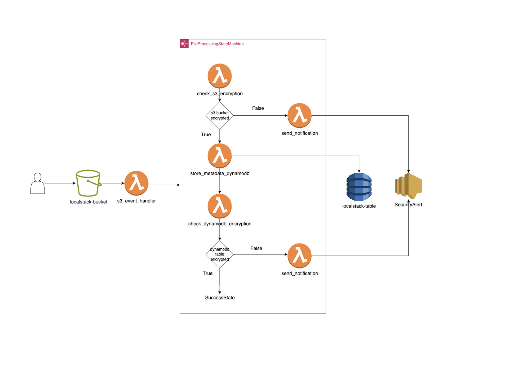

### Setup & Deployment ###

Overall Architecture


Follow these steps to deploy the infrastructure in LocalStack using Terraform.

## Step 1: Navigate to Terraform Directory
```shell
cd terraform/
export AWS_ACCESS_KEY_ID=foobar
export AWS_SECRET_ACCESS_KEY=foobar
export AWS_REGION=eu-central-1
```

## Step 2: Start LocalStack. Open a separate terminal and run
```shell
docker compose up
```
Wait until LocalStack is fully initialized.

## Step 3: Initialize Terraform
```shell
terraform init
terraform apply -auto-approve
```

### Happy Path Testing ###

## Step 1: Upload an Encrypted Object to S3
```shell
    echo "text to file" > testfile.txt
    aws --endpoint-url=http://localhost:4566 s3 cp testfile.txt s3://localstack-bucket/
```

Verify Object Exists in S3
```shell
    aws --endpoint-url=http://localhost:4566 s3 ls s3://localstack-bucket
```

## Step 2: Verify Lambda Triggered the Step Function
```shell
    aws --endpoint-url=http://localhost:4566 logs tail /aws/lambda/s3_event_handler
```

## Step 3: Check Step Function Execution
```shell
    aws --endpoint-url=http://localhost:4566 stepfunctions list-executions \
--state-machine-arn arn:aws:states:eu-central-1:000000000000:stateMachine:FileProcessingStateMachine
```

## Step 4: Verify Object Encryption Check Passed
```shell
    aws --endpoint-url=http://localhost:4566 logs tail /aws/lambda/check_s3_encryption
```

## Step 5: Verify Metadata Stored in DynamoDB and Check DynamoDB Logs
```shell
    aws --endpoint-url=http://localhost:4566 dynamodb scan --table-name localstack-table
    aws --endpoint-url=http://localhost:4566 logs tail /aws/lambda/store_metadata_dynamodb
```

## Step 6: Verify DynamoDB Encryption Check Passed
```shell
    aws --endpoint-url=http://localhost:4566 logs tail /aws/lambda/check_dynamodb_encryption
```

## Step 7: Ensure No SNS Notification Sent
```shell
    aws --endpoint-url=http://localhost:4566 sns list-subscriptions
```

## Step 8: Ensure Lifecycle Policy of S3 bucket objects
```shell
    aws --endpoint-url=http://localhost:4566 s3api get-bucket-lifecycle-configuration --bucket localstack-bucket
```

## Step 9: Running Unit Tests for Lambda Functions
```shell
    cd lambda/
    python3 -m venv myenv
    source myenv/bin/activate
    pip install -r requirements.txt
    pytest s3_event_handler/ 
    pytest check_s3_encryption/ 
    pytest store_metadata_dynamodb/ 
    pytest check_dynamodb_encryption/ 
    pytest send_notification/
```

## Note:
Used this image in docker compose because of new enhancements in the Step Functions provider and to overcome errors when creating Terraform resources.
    image: localstack/localstack:4.1.0
